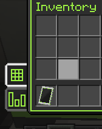
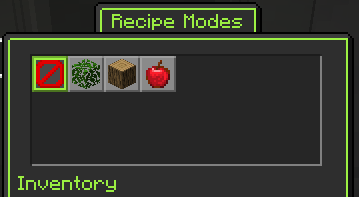

---
navigation:
    title: 配方模式
    icon: minecraft:crafting_table
    parent: fundamentals/index.md
    position: 2
---

# 配方模式

为了让某些配方无缝使用相同的原材料而不出现问题，部分配方具有*配方模式*这一属性，你可以将其理解为配方小类或专门的配方。某些配方模式由多个配方类型共享，如“染料提取”。通过 JEI 可以查看配方是否需要特定模式，以及需要的具体模式。

## 配方模式按钮

对于可选择模式的机器，此按钮位于左下方的侧边栏，机器状态监测图标的上方。此按钮会显示当前模式的图标（若未选择模式则显示网格图标）。
## 模式选择界面

点击配方模式按钮即可打开模式选择界面，此页面中展示了此机器所有可用模式的列表，最多可显示 23 种。