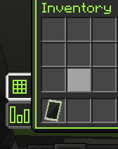
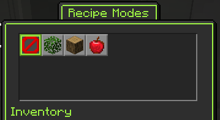

---
navigation:
    title: Recipe Modes
    icon: minecraft:crafting_table
    parent: fundamentals/index.md
    position: 2
---

# Recipe Modes

To allow the seamless sharing of recipe ingredients, certain recipe types have *Recipe Modes*. You can think of these as
recipe subtypes or specializations. Some modes are shared across recipe types such as Dye Extraction. To check what
mode a recipe uses (if any), consult JEI.

## Recipe mode button

On machines that have selectable modes, the button is located in the lower left sidebar, just above the machine stats
widget. It will display the icon of the current mode (or the grid icon if no mode is selected).

## Selection screen

Click the recipe modes button to open the Recipe Modes screen. Here you'll see a list of up to 23 Recipe Modes that the
machine is compatible with.