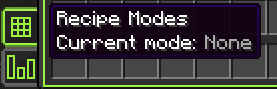
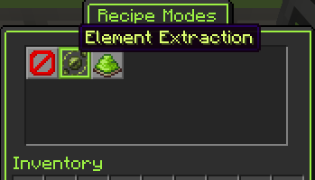

---
navigation:
    title: Recipe Modes
    icon: minecraft:crafting_table
    parent: fundamentals/index.md
    position: 2
---

# Recipe Modes

Some machine recipes share input combinations that would make it impossible to craft both. This is what Recipe Modes are
for. You can think of these as recipe subtypes, or maybe a special 'key' ingredient to specify which recipe will be
used. You may switch these at will, but it is *highly recommended* to dedicate a machine to a recipe mode. It would make a
nasty surprise to leave a stack of Spark Fruits and come back to Electric Chartreuse Pigment instead of Sodium Dust because
you forgot to switch to Element Extraction instead of Dye Extraction.

## Selection

Machines that are compatible with recipe modes will have the selection button on the lower left sidebar. This button
will also show a preview of the icon, as well as the name if hovered over.

## Availability

Each recipe type (and machine) can have up to 23 selectable recipe modes, the first button is always reserved for None.
Selectable modes will come from two sources: the default modes assigned to Recipe Types, and additional ones granted by
[upgrade modules](../fundamentals/upgrade_system.md). Default recipe modes are always available. Recipe modes granted by
upgrade module require the module to remain installed and will reset to None if said module is removed.